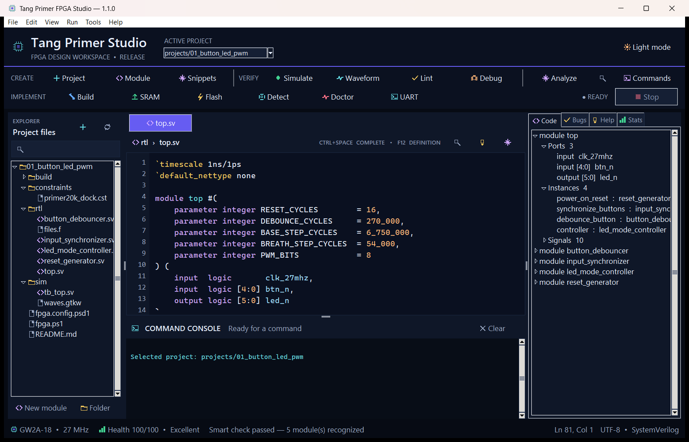
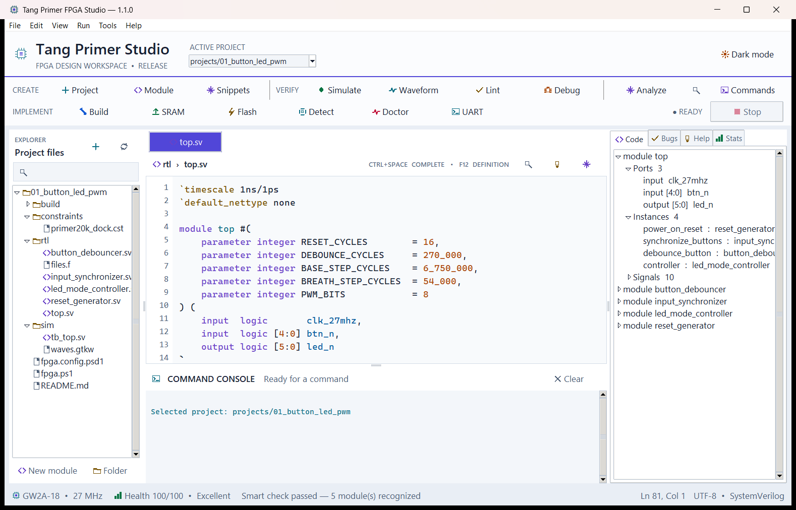

# Tang Primer FPGA Studio — Windows Installer

[](https://github.com/atmarachchige0081/TangPrimer-FPGA-Studio-Installer/releases/latest)
[](https://github.com/atmarachchige0081/TangPrimer-FPGA-Studio-Installer/actions/workflows/release.yml)
[](LICENSE)
[](#requirements)

The one-file Windows installer for
[Tang Primer 20K FPGA Studio](https://github.com/atmarachchige0081/Tang-Primer-20K-FPGA-Studio):
a beginner-friendly IDE for learning Verilog/SystemVerilog, simulating designs,
viewing GTKWave waveforms, building bitstreams, and programming the Sipeed Tang
Primer 20K Dock.

| Dark workspace | Accessible light workspace |
|---|---|
|  |  |

## One-file installation

1. Open the [latest release](https://github.com/atmarachchige0081/TangPrimer-FPGA-Studio-Installer/releases/latest).
2. Download `TangPrimerFPGAStudio-Setup-1.1.0.exe`.
3. Double-click the downloaded file and approve the Windows administrator prompt.
4. Keep **Install or verify the pinned FPGA toolchain** selected.
5. Keep **Create a desktop shortcut** selected and finish installation.
6. Double-click **Tang Primer FPGA Studio** on the Desktop.

The first setup can take several minutes because it downloads and verifies the
approximately 1.9 GB FPGA toolchain. Later launches work offline.

Windows may currently display **Unknown publisher** because v1.1.0 does not
have a commercial Authenticode certificate. See [Release trust](#release-trust)
before deciding whether to run the installer.

## What setup does

- Installs the self-contained Python/Tkinter IDE under Program Files.
- Requires no separate customer Python installation.
- Checks for 64-bit Windows and at least 4 GB of free disk space.
- Downloads the pinned OSS CAD Suite from YosysHQ.
- Verifies the toolchain download using its pinned SHA-256 checksum.
- Downloads Zadig from its upstream release, verifies its SHA-256 checksum,
  and checks its Akeo Consulting Authenticode signature.
- Creates Start Menu and Desktop shortcuts.
- Creates a writable workspace at
  `Documents\Tang Primer FPGA Studio` without overwriting user projects.
- Provides repair, tool diagnosis, and a standard Windows uninstaller.

JTAG driver replacement is intentionally guided rather than automatic. If it
is needed, choose only **JTAG Debugger / USB Serial Converter A — Interface 0**
and install WinUSB. Never replace Interface 1, because it provides the UART COM
port.

## Requirements

- 64-bit Windows 10 or Windows 11
- At least 4 GB free disk space
- Internet access during the first toolchain setup
- Tang Primer 20K + Dock for hardware upload/flash operations

Simulation, HDL intelligence, project editing, and bitstream building do not
require the board to remain attached.

## Release trust

Official release installers are built by the public GitHub Actions workflow in
this repository. GitHub generates a signed Sigstore build-provenance
attestation that binds the installer digest to its repository, commit, tag, and
workflow run. A SHA-256 checksum is published beside every installer.

Verify the checksum in PowerShell:

```powershell
Get-FileHash .\TangPrimerFPGAStudio-Setup-1.1.0.exe -Algorithm SHA256
```

Verify the signed GitHub provenance with GitHub CLI:

```powershell
gh attestation verify .\TangPrimerFPGAStudio-Setup-1.1.0.exe `
  -R atmarachchige0081/TangPrimer-FPGA-Studio-Installer
```

GitHub provenance protects release integrity, but it is not Windows
Authenticode. Windows will continue to show **Unknown publisher** until the
project obtains a trusted code-signing certificate and securely configures it
in the release workflow. A self-signed certificate is deliberately not used.

## Build it yourself

Clone this repository on Windows and run:

```powershell
.\build-installer.ps1
.\test-installer.ps1
```

The isolated build creates:

```text
dist\TangPrimerFPGAStudio-Setup-1.1.0.exe
dist\TangPrimerFPGAStudio-Setup-1.1.0.exe.sha256
```

The full FPGA IDE source, HDL examples, documentation, and issue tracker are in
the [main repository](https://github.com/atmarachchige0081/Tang-Primer-20K-FPGA-Studio).

## Uninstalling

Open **Settings → Apps → Installed apps**, select **Tang Primer FPGA Studio**,
and choose **Uninstall**. Projects under Documents and the large
`C:\fpga-tools` directory are preserved intentionally so uninstalling cannot
erase HDL work or force another toolchain download.

Licensed under the [MIT License](LICENSE).
